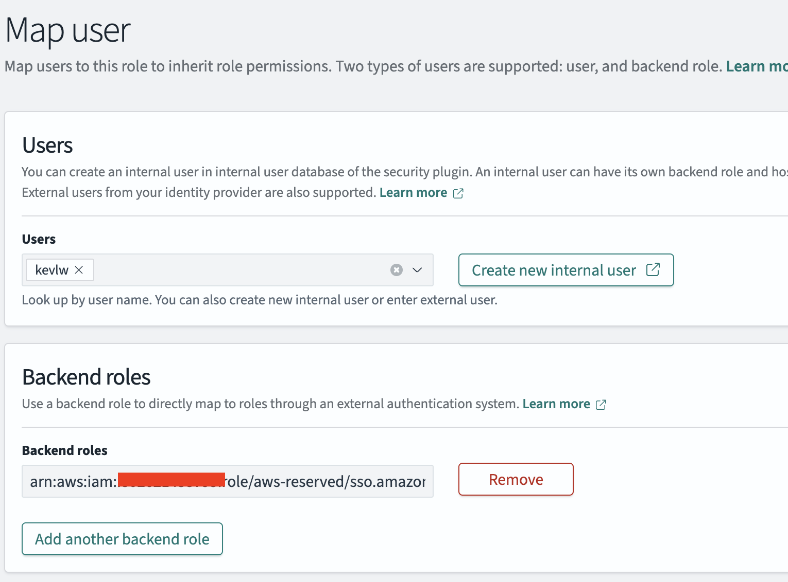
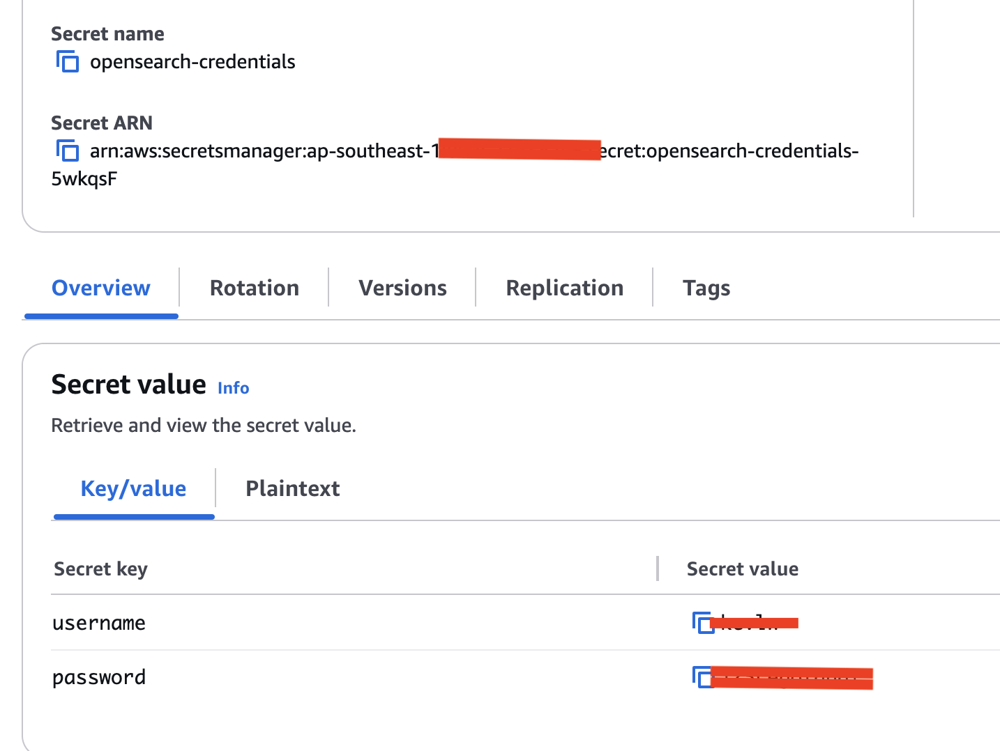
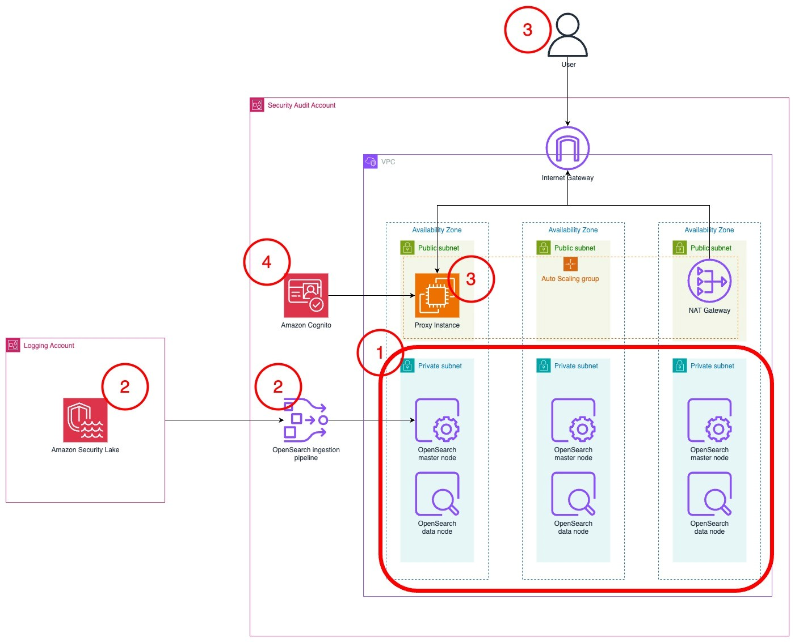

# README
# OCSF 1.1.0 integration with OpenSearch

## Overview
This repository provides resources that will help you ingest [Open Cybersecurity Schema Framework](https://schema.ocsf.io/1.1.0/) (OCSF) logs into OpenSearch and use the logs for [Security Analytics](https://opensearch.org/docs/latest/security-analytics/).

It consists of index and component templates, OpenSearch Ingestion template, [Index State Management](https://opensearch.org/docs/latest/im-plugin/ism/policies/) policy initialization scripts, saved objects (visualizations and index templates), CloudFormation templates to deploy an OpenSearch Cluster, OpenSearch Ingestion Pipeline to ingest from Security Lake, and a deployment script to help you deploy it. Refer to the `Script Deployment Instructions` section for information on how to deploy the resources in an automated manner. 

## Overview of components
### Index and component templates
Index templates (`schemas/index_templates`) automatically apply predefined settings and mappings to indices. 

Component templates (`schemas/component_templates`) are reusable building blocks that contain mapping definitions. Component templates are used as part of index templates. 

The current set of index and component templates are mapped to the OSCF 1.1.0 standard. The repository contains index templates for the following OCSF 1.1.0 categories and classes:

  - System Activity
    - OCSF 1001 - File System Activity
    - OCSF 1002 - Kernel Extension Activity
    - OCSF 1003 - Kernel Activity
    - OCSF 1004 - Memory Activity
    - OCSF 1005 - Module Activity
    - OCSF 1006 - Scheduled Job Activity
    - OCSF 1007 - Process Activity
  - Findings
    - OCSF 2002 - Vulnerability Finding
    - OCSF 2003 - Compliance Finding
    - OCSF 2004 - Detection Finding
    - OCSF 2005 - Incident Finding
  - Identity and Access Management
    - OCSF 3001 - Account Change
    - OCSF 3002 - Authentication
    - OCSF 3003 - Authorize Session
    - OCSF 3004 - Entity Management
    - OCSF 3005 - User Access Management
    - OCSF 3006 - Group Management
  - Network Activity
    - OCSF 4001 - Network Activity
    - OCSF 4002 - HTTP Activity
    - OCSF 4003 - DNS Activity
    - OCSF 4004 - DHCP Activity
    - OCSF 4005 - RDP Activity
    - OCSF 4006 - SMB Activity
    - OCSF 4007 - SSH Activity
    - OCSF 4008 - FTP Activity
    - OCSF 4009 - Email Activity
    - OCSF 4010 - Network File Activity
    - OCSF 4011 - Email File Activity
    - OCSF 4012 - Email URL Activity
    - OCSF 4013 - NTP Activity
  - Discovery 
    - OCSF 5001 - Device Inventory Info
    - OCSF 5002 - Device Config State 
    - OCSF 5003 - User Inventory Info
    - OCSF 5004 - Operating System Patch State
    - OCSF 5019 - Device Config State Change 
  - Application Activity
    - OCSF 6001 - Web Resources Activity
    - OCSF 6002 - Application Lifecycle
    - OCSF 6003 - API Activity
    - OCSF 6004 - Web Resources Access Activity
    - OCSF 6005 - Datastore Activity
    - OCSF 6006 - File Hosting Activity
    - OCSF 6007 - Scan Activity

### OpenSearch Ingestion template
The OpenSearch Ingestion template (`assets/OSI-pipeline.yaml`) provides a template you can use with an OpenSearch Ingestion pipeline to ingest OCSF data. 

### Index State Management (ISM) policy
The ISM policy (`assets/ISM.json`) rollsover the indexes daily or when they have reached 40GB. The ISM policy also deletes indexes that are more than 15 days old.

### Initialization scripts
The initialization script helps set up the component templates, index templates, ISM policy, and aliases in the OpenSearch cluster. 

By default, the script will use AWS IAM SigV4 request signing to authenticate to your cluster. This is the recommended method if you are using Amazon OpenSearch service.

The machine that runs the script will need AWS `ec2:Describe*` and `es:ESHttp*` permissions. The IAM principal that the machine uses will need to be mapped to the `all_access` role in your OpenSearch cluster. 



If you can't use AWS IAM SigV4, you can use basic auth. The script will look for the OpenSearch master username and password as a secret in AWS Secrets Manager in the same region as your OpenSearch cluster. The secret needs to be called `opensearch-credentials` and have two keys: `username` and `password`. 



### OpenSearch objects
The OpenSearch objects (`assets/OCSF_objects.ndjson`) contains visualizations, dashboards, and index patterns to help you get started with exploring OCSF data. Visualizations include: 

* OCSF High level overview (All OCSF categories) page


* OCSF Findings (2000 series) overview page


* Network Activity (4001) Org level overview


* Network Activity (4001) Account Level Drill Down


* DNS Activity (4003) Org level overview


## Script Deployment Instructions
These instructions will guide you with deploying an OpenSearch cluster to ingest logs from Amazon Security Lake.

The architecture below shows the completed architecture of the solution.
1. An OpenSearch Service cluster is deployed within a virtual private cloud (VPC) across three Availability Zones for high availability.
2. The OpenSearch Service cluster ingests logs from Security Lake using an OpenSearch Ingestion pipeline.
3. The cluster is accessed by end users through a public-facing proxy hosted on an Amazon EC2 instance.
4. Authentication to the cluster is managed with Amazon Cognito.
5. An initalization Lambda function to install the mappings into the cluster (not shown)



### Prerequisites
* Security Lake should already be deployed.
* A Security Lake subscriber should be created with the S3 data access method and SQS queue notification type.
* You will need AWS Identity and Access Management (IAM) permissions to manage Security Lake, OpenSearch Service, Amazon Cognito, AWS Secrets Manager, and Amazon Elastic Compute Cloud (Amazon EC2), and to create IAM roles to follow along with this post.
* The solution can be deployed in any AWS Region that has at least 3 Availability Zones, supports Security Lake, OpenSearch, and OpenSearch Ingestion.

### Deployment instructions
1. Ensure that your AWS configuration in your terminal is set to the same region as your Security Lake subscriber. 
2. In the top level directory of this repository, run `sh deploy-script.sh ` in your terminal. This script will create the relevant service-linked roles and zip and upload the CloudFormation templates and Lambda assets to an S3 bucket in your account. 
3. Wait for the script to complete. The final line should say `Setup complete. Asset bucket name: os-stack-deploy-assets-xxxxxxx`. Record this bucket name in a text editor.
4. Deploy the `deployment/cfn/quickstart-kickoff.json` file in CloudFormation. Under the `AssetsBucketName` parameter, fill in the name of the bucket that you recorded earlier. Fill in the rest of the parameters accordingly.
5. It will take up to 30 minutes to deploy. Following the deployment, go to the Outputs pane of the main CloudFormation stack. Save the `DashboardsProxyURL`, `OpenSearchInitRoleARN`, and `PipelineRole` values in a text editor to refer to later.
6. Open the DashboardsProxyURL value in a new tab.
**Note**: Because the proxy relies on a self-signed certificate, you will get an insecure certificate warning. You can safely ignore this warning and proceed. For a production workload, you should issue a trusted private certificate from your internal public key infrastructure or use AWS Private Certificate Authority.
7. You will be presented with the Amazon Cognito sign-in page. Use administrator as the username.
8. Access Secrets Manager to find the password. Select the secret that was created as part of the stack.
9. After signing in, you will be prompted to change your password and will be redirected to the OpenSearch dashboard.

### Initializing the cluster
1. Choose the menu icon (three stacked horizontal lines) on the top left and select Security under the Management section.
2. Select **Roles**. On the **Roles** page, search for the `all_access` role and select it.
3. Select **Mapped users**, and then select **Manage mapping**.
4. On the **Map user** screen, choose **Add another backend role**. Paste the value for the `OpenSearchInitRoleARN` from the list of CloudFormation outputs. Choose **Map**.
5. Leave this tab open and return to the AWS Management console. Go to the **AWS Lambda** console and select the function named `xxxxxx-OS_INIT`.
6. In the function screen, choose **Test**, and then **Create new test event**.
7. Choose **Invoke**. The function should run for about 30 seconds. The execution results should show the component templates that have been created. This Lambda function creates the component and index templates to ingest Open Cybersecurity Framework (OCSF) formatted data, a set of indices and aliases that correspond with the OCSF classes generated by Security Lake, and a rollover policy that will rollover the index daily or if it becomes larger than 40 GB.

### Setting up the pipeline
1. Return to the **Map user** page on the OpenSearch console.
2. Choose **Add another backend role**. Paste the value of the `PipelineRole` from the CloudFormation template output. This will allow the OpenSearch Ingestion to write to the cluster.
3. Access the Amazon S3 console in the Log Archive account where Security Lake is hosted.
4. Select the Security Lake bucket in your roll-up Region. It should look like `aws-security-data-lake-region-xxxxxxxxxx`.
5. Choose **Permissions**, then **Edit** under **Bucket policy**.
6. Add this policy to the end of the existing bucket policy. Replace the Principal with the ARN of the PipelineRole and the name of your Security Lake bucket in the Resource section.
```
{
  "Sid": "Cross Account Permissions",
  "Effect": "Allow",
  "Principal": {
      "AWS": "<Pipeline role ARN>"
  },
  "Action": "s3:*",
  "Resource": [
      "arn:aws:s3:::<Security Lake bucket name>/*",
      "arn:aws:s3:::<Security Lake bucket name>"
  ]
}
```
7. Choose **Save changes**.

### Installing the Visualizations and Index templates
1. Log in to the OpenSearch cluster 
2. Expand the hamburger menu on the top left and select **Dashboards Management** 

3. Select **Saved Objects**, then select **Import**. 

4. Select **Import**, then select the `assets/OCSF_objects.ndjson` file. Select **Open** and then **Import**. 

### Cleaning up
1. Delete the CloudFormation nested stack
2. Run `sh destroy-script.sh -b<your asset bucket name>` to empty and delete the asset bucket. 

## Manual deployment into an existing cluster
### Installing the index and component templates (IAM Auth)
* This script will install the mappings, aliases, index templates, and ISM policy for your cluster. 

* This method will use AWS IAM SigV4 request signing to authenticate to your cluster. The machine that runs the script will need `ec2:Describe*` and `es:ESHttp*` permissions.

* This is the recommended method if you are using Amazon OpenSearch service. 

1. Download the index (`schemas/index_templates.zip`) and component template (`schemas/component_templates.zip`) zip files. Upload them to an S3 bucket.
2. Download the `os_init.py` file and open it in a code editor. 
3. Modify the `OSEndpoint`, `region`, `bucket_name`, `component_templates`, and `index_templates` variables to match your set up.
4. Ensure that the IAM principal you're using on your machine is mapped to the OpenSearch `all_access` role. 
4. Run the `os_init.py` file in your code editor. It will connect to your cluster and install the mappings, aliases, index templates, and the ISM policy to your cluster. 

### Installing the index and component templates (Basic Auth)
* This script will install the mappings, aliases, index templates, and ISM policy for your cluster. 
* This method will use the OpenSearch username and password to authenticate to your cluster.

1. Download the index (`schemas/index_templates.zip`) and component template (`schemas/component_templates.zip`) zip files. Upload them to an S3 bucket.
2. Download the `os_init.py` file and open it in a code editor. 
3. Modify the `OSEndpoint`, `region`, `bucket_name`, `component_templates`, and `index_templates` variables to match your set up.
4. Create a secret in AWS Secrets Manager in the same region as your cluster. The secret needs to be called `opensearch-credentials` and have two keys: `username` and `password`. 
4. Run the `os_init.py` file in your code editor. It will connect to your cluster and install the mappings, aliases, index templates, and the ISM policy to your cluster. 

### Installing the Visualizations and Index templates
1. Log in to the OpenSearch cluster 
2. Expand the hamburger menu on the top left and select **Dashboards Management** 

3. Select **Saved Objects**, then select **Import**. 

4. Select **Import**, then select the `assets/OCSF_objects.ndjson` file. Select **Open** and then **Import**. 

## Security
See [CONTRIBUTING](CONTRIBUTING.md#security-issue-notifications) for more information.

## License
This library is licensed under the MIT-0 License. See the LICENSE file.

